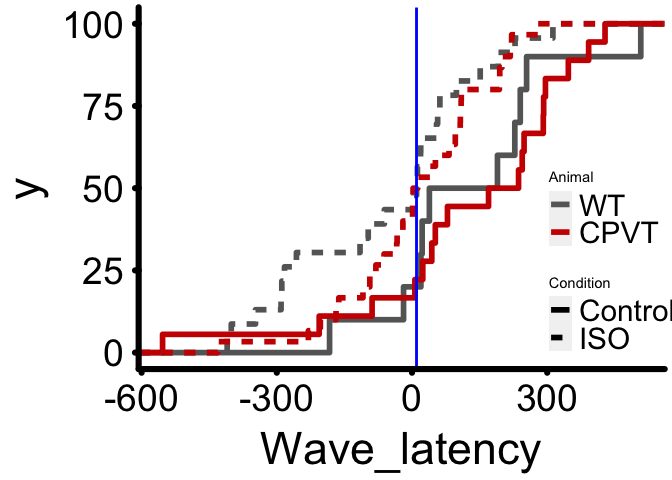

<!-- README.md is generated from README.Rmd. Please edit that file -->

# AnlysisOfWaves

<!-- badges: start -->

[](https://github.com/rjlopez2/AnlysisOfWaves/actions)
<!-- badges: end -->

The goal of AnlysisOfWaves is to easily reproduce the analysis of Ca2+
waves in the publication …

## Installation

This package is only available in this git repository. You can install
it from [GitHub](https://github.com/) with:

``` r
# install.packages("devtools")
devtools::install_github("rjlopez2/AnlysisOfWaves")
```

## Example

This is a basic example which shows you how plot the cumulative
occurrence of Ca2+ waves obtained from linescan images:

``` r
library(AnlysisOfWaves)

wave_or_EAP_threshold <- 10 # Set time for highlighting the relative wave occurrence.

df_waves_intact_cells %>%
  my_cum_occu_wave_plot_func(reffer_wave_thres = wave_or_EAP_threshold,
                             my_var = "Wave_latency",
                             base_size = 28, line_size = 2)
```


